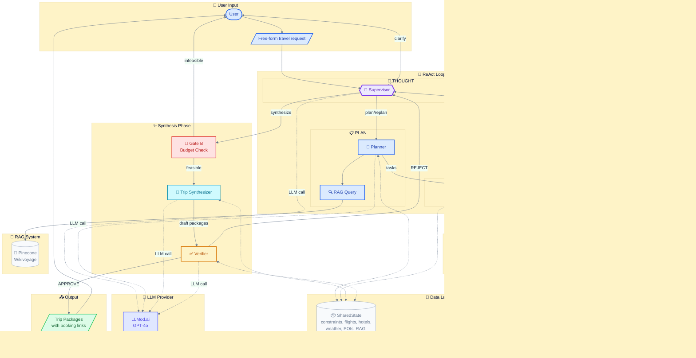

# AI Travel Agent - System Architecture

## Overview

This document describes the architecture of an **autonomous AI Travel Agent** that uses a **Supervisor-driven ReAct pattern** to plan complete trip packages from free-form user requests.

### Real architecture (as implemented)

The diagrams and sections below match the codebase:

- **RAG (Pinecone Wikivoyage):** The **Planner** queries RAG (e.g. prefetch via `search_destinations`) and stores results in **SharedState** as `destination_chunks`. The **Executor** can also run `rag_search` tasks that query RAG. The **Trip Synthesizer** does not call Pinecone; it uses **RAG chunks from SharedState** (`state.destination_chunks`) to ground itineraries in Wikivoyage knowledge.
- **Supabase:** Primary persistence layer. Used for **cache** (tool results), **trips**, **sessions**, and **execution_logs**. The PNG diagram and Mermaid both show Supabase in the data layer; the README Mermaid is simplified but references it in the text.
- **Flow:** Supervisor → Planner (plan/replan) → Executor (tasks) → tools and RAG; Gate B (budget) → Synthesizer → Verifier; SharedState is read/written by Planner, Executor, Synthesizer, and Verifier.

---

## Architecture Diagram



---

## Component Details

### Agent Modules (LLM-powered)

| Module | Role | Phase | LLM Calls |
|--------|------|-------|-----------|
| **Supervisor** | Autonomous decision-making brain. Called at every decision point to reason about state and choose next action. | THOUGHT | 1+ per request |
| **Planner** | Extracts constraints from user prompt and generates executable task plan. Uses RAG for destination grounding. | PLAN | 1 per planning cycle |
| **Trip Synthesizer** | Assembles tiered trip packages (Budget/Best Value/Premium) from collected tool data. Uses **RAG chunks from SharedState** (Wikivoyage) to ground itineraries; does not call Pinecone directly. | SYNTHESIS | 1 per synthesis |
| **Verifier** | Audits packages with rule-based checks + LLM quality assessment. Can approve or reject. | REFLECTION | 1 per verification |

### Non-LLM Components

| Component | Role |
|-----------|------|
| **Executor** | Runs tools in parallel using ThreadPoolExecutor. Zero LLM calls. |
| **Gate B** | Deterministic budget feasibility check before synthesis. Zero LLM calls. |
| **SharedState** | Central data store shared by all components. Persists tool results. |

---

## Supervisor Actions

The Supervisor is the decision-making brain called at **every decision point**:

| Action | Description |
|--------|-------------|
| `ask_clarification` | Request missing critical info (e.g., origin city) |
| `plan` | Create initial task plan via Planner |
| `continue` | Execute remaining destination groups |
| `pivot` | Change strategy due to issues (e.g., too expensive) |
| `synthesize` | Build trip packages from collected data |
| `finalize` | Return approved plan to user |
| `replan` | Fix issues after Verifier rejection |

---

## External Services

| Service | Purpose | Cost |
|---------|---------|------|
| **LLMod.ai** | LLM reasoning (GPT-4o) | ~$0.01-0.05/call |
| **Pinecone** | RAG vector DB (Wikivoyage knowledge) | Free tier |
| **Supabase** | Cache, trip storage, session persistence | Free tier |
| **Booking.com API** | Flights + Hotels search | Freemium |
| **Open-Meteo** | Weather forecasts + climate normals | Free |
| **OpenTripMap** | Points of interest | Free |

---

## LLM Budget Management

| Constraint | Value |
|------------|-------|
| Max LLM calls per request | 12 |
| Typical successful run | 5-7 calls |
| Max Supervisor rounds | 8 |
| Budget tolerance | 5% |

### Typical LLM Call Sequence

```
1. Supervisor     → "plan" decision
2. Planner        → constraints + tasks
3. Supervisor     → "continue" (observe Phase 1 results)
4. Supervisor     → "synthesize" (enough data)
5. Synthesizer    → build packages
6. Verifier       → audit and approve
```

---

## Data Flow

```
User Prompt
    │
    ▼
┌─────────────────────────────────────────────────┐
│  SUPERVISOR (observes state, decides action)    │
└─────────────────────────────────────────────────┘
    │                                         ▲
    ▼                                         │
┌─────────────┐      ┌─────────────┐         │
│   PLANNER   │ ──▶  │  EXECUTOR   │ ────────┘
│  +RAG query │      │  (parallel) │    observe
└─────────────┘      └─────────────┘
                            │
                            ▼
              ┌─────────────────────────┐
              │    TOOLS (Flights,      │
              │    Hotels, Weather,     │
              │    POIs)                │
              └─────────────────────────┘
                            │
                            ▼
              ┌─────────────────────────┐
              │     SharedState         │
              │  (persists all data)    │
              └─────────────────────────┘
                            │
                            ▼
              ┌─────────────────────────┐
              │   TRIP SYNTHESIZER      │
              │   (builds packages)     │
              └─────────────────────────┘
                            │
                            ▼
              ┌─────────────────────────┐
              │      VERIFIER           │
              │   (approves/rejects)    │
              └─────────────────────────┘
                            │
                            ▼
                    Trip Packages
```

---

## What Makes This an Agent

1. **Multi-round Supervisor (ReAct)** - Called 3+ times per request with Thought → Action → Observation cycles
2. **Phased execution** - Searches destinations one at a time, observes results between phases
3. **Adaptive decisions** - Can skip expensive destinations, pivot to cheaper ones based on observations
4. **RAG grounding** - Uses Wikivoyage knowledge to inform destination choices
5. **Self-healing** - On Verifier rejection, loops back for delta replanning
6. **Budget awareness** - Compares prices to budget at every decision point
7. **Scope guard** - Refuses non-travel requests politely
