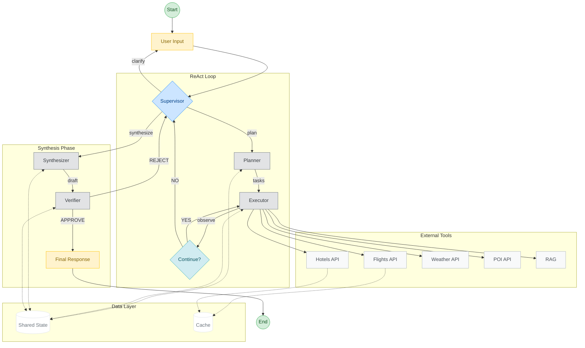

# AI Travel Agent - Architecture Diagram

## Architecture Overview

### Components

| Component | Role | Phase |
|-----------|------|-------|
| **Supervisor** | Autonomous decision-making brain. Called at every decision point. | THOUGHT |
| **Planner** | Extracts constraints and generates executable tasks. | PLAN |
| **Executor** | Runs tasks in parallel using ThreadPoolExecutor. | ACTION |
| **Trip Synthesizer** | Assembles trip packages from collected data. | SYNTHESIS |
| **Verifier** | Audits packages with rule-based and LLM checks. | REFLECTION |
| **SharedState** | Central data store shared by all components. | - |

### Supervisor Actions

| Action | Description |
|--------|-------------|
| `ask_clarification` | Request missing info from user |
| `plan` | Create initial task plan |
| `continue` | Execute remaining destination groups |
| `pivot` | Change strategy due to issues |
| `synthesize` | Build trip packages |
| `finalize` | Return approved plan to user |
| `replan` | Fix issues after Verifier rejection |

### Tools

| Tool | Purpose |
|------|---------|
| Flights API | Search flight options |
| Hotels API | Search hotel options |
| Weather API | Get weather forecasts |
| POI API | Find points of interest |
| RAG (Pinecone) | Retrieve destination knowledge |
| Cache (Supabase) | Store and reuse API results |

### Constraints

- Maximum 6 ReAct loop iterations
- Maximum 8 LLM calls per session
- Budget validation via Gate B before synthesis
