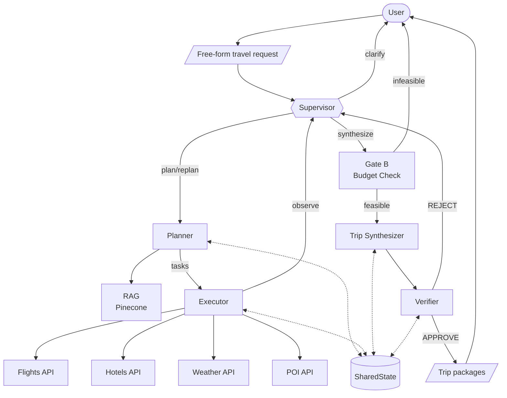

# AI Travel Agent

Autonomous full-package travel planning agent. Give it a free-form travel request; it reasons at every step, searches real flights, hotels, weather, and POIs, and returns complete priced trip packages.

**Team:** Ofek Fuchs & Omri Lazover

---

## Quick Start

### Prerequisites

- Python 3.11+
- API keys (see [Configuration](#configuration))

### Install and run

```bash
cd ai-travel-agent
python -m venv .venv
source .venv/bin/activate   # Windows: .venv\Scripts\activate
pip install -r requirements.txt
```

Create a `.env` file (see [Configuration](#configuration)), then:

```bash
# Optional: seed RAG with Wikivoyage data (~350 cities)
python scripts/seed_test_data.py

# Run the server
uvicorn app.main:app --host 127.0.0.1 --port 8001
```

Open http://127.0.0.1:8001 in your browser, or call the API:

```bash
curl -X POST http://127.0.0.1:8001/api/execute -H "Content-Type: application/json" -d '{"prompt": "Beach vacation in June from New York"}'
```

---

## How it works

### What you need to have running

1. **Python environment** – venv activated, `pip install -r requirements.txt` done.
2. **Environment variables** – `.env` in the project root with at least:
   - `LLM_API_KEY`, `LLM_BASE_URL`, `LLM_MODEL` (required for the agent to run).
   - `RAPIDAPI_KEY` (for flights/hotels; optional but recommended).
   - `PINECONE_*` (for RAG; optional – agent works without it, but destination suggestions are less grounded).
   - `SUPABASE_*` (for cache and persistence; optional – in-memory fallback if missing).
   - `OPENTRIPMAP_API_KEY` (for POIs; optional).
3. **Server** – run `uvicorn app.main:app --host 127.0.0.1 --port 8001`. Only this process serves the API and frontend; no separate frontend build.
4. **Optional: RAG data** – run `python scripts/seed_test_data.py` once to fill Pinecone with Wikivoyage content for ~350 cities. If you skip it, the agent still runs but plans without that knowledge.
5. **Optional: Supabase tables** – if you use Supabase, create `cache`, `trips`, `sessions`, `execution_logs` (see [Configuration](#configuration)). If you don’t, the app uses in-memory cache and no persistence.

### What happens when you send a prompt

1. **Request** – You POST `{"prompt": "Beach vacation in June from New York"}` to `/api/execute` (or use the UI).
2. **Supervisor (1st time)** – The Supervisor LLM call decides the first action: e.g. "plan" if there’s enough info, or "ask_clarification" if origin/dates are missing.
3. **Planner** – If the decision was "plan", the Planner runs once: it extracts constraints (origin, dates, budget, etc.) and produces a list of tasks (search_flights, search_hotels, get_weather, search_pois). It can use RAG (Pinecone) to choose destinations.
4. **Executor** – Tools run in parallel (no LLM): Booking.com for flights/hotels, Open-Meteo for weather, OpenTripMap for POIs. Results are written into shared state; Supabase can cache them.
5. **Supervisor (again)** – After the first destination’s data is in, the Supervisor is called again. It sees the current state (e.g. flight/hotel counts per city) and decides: "continue" (run the next destination), "synthesize" (enough data, build packages), or "pivot" (change strategy).
6. **Loop** – Steps 4–5 repeat until the Supervisor chooses "synthesize" or hits the max round limit.
7. **Gate B** – Before synthesis, a deterministic check verifies that the cheapest possible trip fits the budget. If not, the API returns a budget-infeasible message and suggestions (no extra LLM).
8. **Trip Synthesizer** – One LLM call builds 1–3 packages (e.g. Budget Pick, Best Value, Premium) from the collected flights/hotels/weather/POIs.
9. **Verifier** – One LLM call plus rules (e.g. budget, required fields) to approve or reject. If rejected, the Supervisor can decide to "replan" and the loop continues if LLM budget allows.
10. **Response** – The API returns `status`, `response` (e.g. JSON of packages), and `steps` (every LLM call: module name, prompt, response).

So: **only the server (uvicorn) must be running**; the rest is config and optional seeding. The diagram below summarizes this flow.

---

## Architecture

### Diagram (Mermaid)

View this README on **GitHub** (or any Markdown viewer that renders Mermaid) to see the diagram rendered. The same diagram is in [ARCHITECTURE.md](ARCHITECTURE.md).



### PNG version


### Modules

| Module | Role |
|--------|------|
| **Supervisor** | Decides next action from current state (plan / continue / synthesize / clarify). |
| **Planner** | Extracts constraints and builds a task plan; uses RAG (Pinecone/Wikivoyage) for destinations. |
| **Executor** | Runs tools in parallel (flights, hotels, weather, POIs). No LLM calls. |
| **Trip Synthesizer** | Builds tiered packages (Budget / Best Value / Premium) from collected data. |
| **Verifier** | Checks packages (rules + LLM) and approves or rejects. |

**External services:** LLMod.ai (LLM), Pinecone (RAG), Supabase (cache + persistence), Booking.com (flights/hotels), Open-Meteo (weather), OpenTripMap (POIs).

**LLM budget:** Up to 12 LLM calls per request; a typical successful run uses 5–7.

---

## API

| Method | Path | Description |
|--------|------|-------------|
| GET | `/` | Frontend UI |
| GET | `/health` | Health check |
| GET | `/api/team_info` | Team and student details |
| GET | `/api/agent_info` | Agent description, purpose, prompt template, examples with steps |
| GET | `/api/model_architecture` | Architecture diagram (PNG) |
| POST | `/api/execute` | Run the agent; body `{"prompt": "..."}`; returns `status`, `error`, `response`, `steps` |

**POST /api/execute** returns JSON with:

- `status`: `"ok"` or `"error"`
- `error`: `null` or a string
- `response`: string (e.g. JSON of packages) or `null`
- `steps`: array of `{ "module", "prompt", "response" }` for each LLM call

---

## Testing

**Endpoint checks** (server must be running on port 8001):

```bash
uvicorn app.main:app --host 127.0.0.1 --port 8001 &
python scripts/check_endpoints.py --base-url http://127.0.0.1:8001
```

**Unit tests** (no server, no LLM):

```bash
python -m pytest tests/ -v
```

**E2E smoke tests** (server must be running):

```bash
python scripts/test_e2e_smoke.py --base-url http://127.0.0.1:8001
```

**Tool checks** (no LLM, uses real APIs):

```bash
python scripts/test_tools_dry.py
```

---

## Project Structure

```
app/
├── main.py              # FastAPI app and Supervisor loop
├── config.py            # Env and config
├── agents/              # Supervisor, Planner, Executor, Synthesizer, Verifier
├── tools/               # Flights, hotels, weather, POI, RAG, geocode
├── llm/                 # LLM client and call cap
├── rag/                 # Pinecone retriever
├── models/              # SharedState, Pydantic schemas
└── utils/               # Cache, trip store, step logger
frontend/                # UI (HTML, CSS, JS)
scripts/                 # seed_test_data, check_endpoints, test_e2e_smoke, etc.
tests/                   # Unit tests (test_deterministic.py)
architecture.png         # System diagram
ARCHITECTURE.md          # Diagram (Mermaid) and component docs
```

---

## Configuration

Create `.env` in the project root:

```env
LLM_API_KEY=...
LLM_BASE_URL=https://api.llmod.ai/v1
LLM_MODEL=gpt-4o
EMBEDDING_MODEL=text-embedding-3-small

PINECONE_API_KEY=...
PINECONE_ENVIRONMENT=...
PINECONE_INDEX_NAME=wikivoyage-index

SUPABASE_URL=...
SUPABASE_ANON_KEY=...

RAPIDAPI_KEY=...
OPENTRIPMAP_API_KEY=...
```

Supabase tables: `cache`, `trips`, `sessions`, `execution_logs` (see [ARCHITECTURE.md](ARCHITECTURE.md) or run the SQL from the Supabase dashboard).

---

## Features

- **ReAct loop:** Supervisor runs multiple times per request (observe → decide → act).
- **Phased execution:** One destination group at a time so the Supervisor can adapt.
- **Budget gate:** Stops early if the trip is provably over budget (Gate B).
- **RAG:** Wikivoyage-based destination knowledge via Pinecone.
- **Session continuity:** Follow-up prompts keep context (constraints, previous packages).
- **Scope guard:** Non-travel prompts get a polite redirect.

---

## Example prompts

- "Beach vacation in June from New York"
- "4 days in Rome in September, budget $1500 from NYC"
- "Europe in May, best value, 1 week"
- "Family trip to Barcelona, 5 adults, August 10–17 2026, budget $7000 from TLV"
