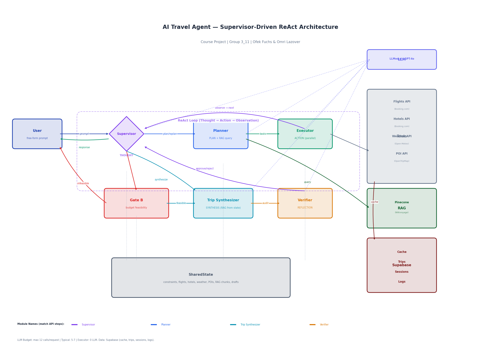

# AI Travel Agent

An autonomous travel planning agent that turns free-form requests (e.g. "beach vacation in June from New York") into full trip packages: flights, hotels, weather, and day-by-day itineraries with real pricing and booking links.

**Authors:** Ofek Fuchs, Omri Lazover

---

## Table of Contents

- [Features](#features)
- [Installation](#installation)
- [Configuration](#configuration)
- [Usage](#usage)
- [API Reference](#api-reference)
- [Architecture](#architecture)
- [Project Structure](#project-structure)
- [Testing](#testing)
- [Example Prompts](#example-prompts)

---

## Features

- **ReAct-style agent** — A Supervisor module runs at every decision point: it observes collected data (flights, hotels per city) and decides whether to plan, continue searching, synthesize packages, or ask for clarification.
- **Real data** — Integrates with Booking.com (flights & hotels), Open-Meteo (weather), and OpenTripMap (POIs). Results are cached in Supabase when configured.
- **RAG-backed planning** — Optional Pinecone index over Wikivoyage content (~350 cities) to ground destination choices.
- **Tiered packages** — Returns 1–3 options (e.g. Budget Pick, Best Value, Premium) with cost breakdowns, itineraries, and booking URLs.
- **Budget guard** — Stops early with a clear message if the trip cannot fit the user’s budget (Gate B).
- **Multi-turn** — Follow-up messages in the same session keep context (constraints, previous packages).
- **Scope guard** — Politely declines non-travel requests.

---

## Installation

**Prerequisites:** Python 3.11 or higher.

```bash
# Clone the repository (or navigate to the project folder)
cd ai-travel-agent

# Create and activate a virtual environment
python -m venv .venv
source .venv/bin/activate   # On Windows: .venv\Scripts\activate

# Install dependencies
pip install -r requirements.txt
```

No build step is required; the frontend is static and served by the same process.

---

## Configuration

Create a `.env` file in the project root.

**Required for the agent to run:**

| Variable        | Description                    |
|----------------|--------------------------------|
| `LLM_API_KEY`  | API key for the LLM provider   |
| `LLM_BASE_URL` | e.g. `https://api.llmod.ai/v1` |
| `LLM_MODEL`    | e.g. `gpt-4o`                  |
| `EMBEDDING_MODEL` | e.g. `text-embedding-3-small` (for RAG) |

**Optional but recommended:**

| Variable              | Description                          |
|-----------------------|--------------------------------------|
| `RAPIDAPI_KEY`        | For Booking.com flights and hotels   |
| `PINECONE_API_KEY`    | For RAG (Wikivoyage destinations)   |
| `PINECONE_ENVIRONMENT`| Pinecone environment                |
| `PINECONE_INDEX_NAME` | e.g. `wikivoyage-index`              |
| `SUPABASE_URL`        | For cache and persistence           |
| `SUPABASE_ANON_KEY`   | Supabase anon key                    |
| `OPENTRIPMAP_API_KEY` | For points of interest               |

Example `.env`:

```env
LLM_API_KEY=your_key
LLM_BASE_URL=https://api.llmod.ai/v1
LLM_MODEL=gpt-4o
EMBEDDING_MODEL=text-embedding-3-small

RAPIDAPI_KEY=your_rapidapi_key
PINECONE_API_KEY=your_pinecone_key
PINECONE_ENVIRONMENT=your_env
PINECONE_INDEX_NAME=wikivoyage-index

SUPABASE_URL=https://your-project.supabase.co
SUPABASE_ANON_KEY=your_anon_key
OPENTRIPMAP_API_KEY=your_opentripmap_key
```

**Optional setup:**

- **RAG:** Run `python scripts/seed_test_data.py` once to populate Pinecone with Wikivoyage data. The agent runs without it but with less destination context.
- **Supabase:** If you use Supabase, create tables `cache`, `trips`, `sessions`, `execution_logs`. Schema is documented in [ARCHITECTURE.md](ARCHITECTURE.md). Without them, the app uses in-memory cache and no persistence.

---

## Usage

**1. Start the server**

```bash
uvicorn app.main:app --host 127.0.0.1 --port 8001
```

**2. Use the web UI**

Open [http://127.0.0.1:8001](http://127.0.0.1:8001) in your browser. Enter a prompt in the text area and send; the response and execution trace (steps) are shown below.

**3. Call the API**

```bash
curl -X POST http://127.0.0.1:8001/api/execute \
  -H "Content-Type: application/json" \
  -d '{"prompt": "Beach vacation in June from New York"}'
```

The response includes `status`, `response` (e.g. JSON of packages), and `steps` (each LLM call with module name, prompt, and response).

---

## API Reference

| Method | Endpoint                   | Description |
|--------|----------------------------|-------------|
| GET    | `/`                        | Serves the web UI. |
| GET    | `/health`                  | Health check; returns `{"status": "ok"}`. |
| GET    | `/api/team_info`           | Team name and student list (name, email). |
| GET    | `/api/agent_info`          | Agent description, purpose, prompt template, and example(s) with full response and steps. |
| GET    | `/api/model_architecture`  | Returns the architecture diagram as a PNG image. |
| POST   | `/api/execute`             | Main entry point. Body: `{"prompt": "user request"}`. Optional: `"session_id"` for follow-ups. |

**POST /api/execute** response (success):

- `status`: `"ok"`
- `error`: `null`
- `response`: string (often JSON of trip packages)
- `steps`: array of `{ "module", "prompt", "response" }` for each LLM step (Supervisor, Planner, Trip Synthesizer, Verifier, etc.)

On error, `status` is `"error"`, `error` contains a message, and `response` is `null`.

---

## Architecture

The agent uses a **Supervisor-driven ReAct loop**: the Supervisor is invoked after each phase, observes the current state (e.g. how many flights/hotels per city), and chooses the next action (plan, continue, synthesize, clarify, or replan). The Planner produces a task list; the Executor runs tools in parallel (no LLM); the Trip Synthesizer builds packages; the Verifier approves or rejects. A deterministic Gate B checks budget feasibility before synthesis.

**High-level flow (Mermaid).** On GitHub this block renders as a diagram:


**Diagram (PNG):**



**Components:**

| Component          | Role |
|--------------------|------|
| Supervisor         | Decides next action from current state. |
| Planner            | Extracts constraints and task list; can query RAG (Pinecone). |
| Executor           | Runs tools (flights, hotels, weather, POIs) in parallel; no LLM. |
| Trip Synthesizer   | Builds 1–3 packages from collected data. |
| Verifier           | Validates packages (rules + LLM); approve or reject. |
| Gate B             | Deterministic budget check before synthesis. |

**External services:** LLMod.ai (LLM), Pinecone (RAG), Supabase (cache/persistence), Booking.com, Open-Meteo, OpenTripMap. The agent uses a cap of 12 LLM calls per request; a typical run uses 5–7.

For a detailed diagram and data flow, see [ARCHITECTURE.md](ARCHITECTURE.md).

---

## Project Structure

```
ai-travel-agent/
├── app/
│   ├── main.py           # FastAPI app and Supervisor loop
│   ├── config.py         # Environment and config
│   ├── agents/           # Supervisor, Planner, Executor, Synthesizer, Verifier
│   ├── tools/            # Flights, hotels, weather, POI, RAG, geocode
│   ├── llm/              # LLM client and call cap
│   ├── rag/              # Pinecone retriever
│   ├── models/           # SharedState, Pydantic schemas
│   └── utils/            # Cache, trip store, step logger
├── frontend/             # Static UI (HTML, CSS, JS)
├── scripts/              # seed_test_data, check_endpoints, test_e2e_smoke, etc.
├── tests/                # Unit tests
├── architecture.png      # Architecture diagram
├── ARCHITECTURE.md       # Detailed architecture and Mermaid
├── requirements.txt
└── README.md
```

---

## Testing

**Unit tests** (no server, no LLM):

```bash
pytest tests/ -v
```

**Endpoint checks** (server must be running, e.g. on port 8001):

```bash
python scripts/check_endpoints.py --base-url http://127.0.0.1:8001
```

**E2E smoke tests** (server running):

```bash
python scripts/test_e2e_smoke.py --base-url http://127.0.0.1:8001
```

**Tool checks** (no LLM; uses real APIs and may incur small cost):

```bash
python scripts/test_tools_dry.py
```

---

## Example Prompts

- Beach vacation in June from New York  
- 4 days in Rome in September, budget $1500 from NYC  
- Europe in May, best value, 1 week  
- Family trip to Barcelona, 5 adults, August 10–17 2026, budget $7000 from TLV  

---

## License

MIT (or your chosen license).
